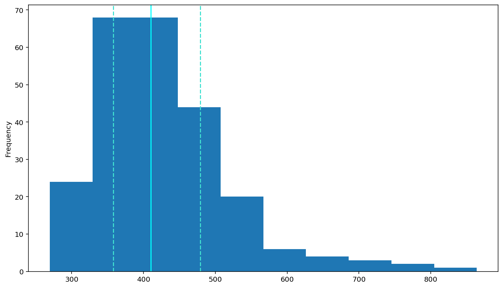
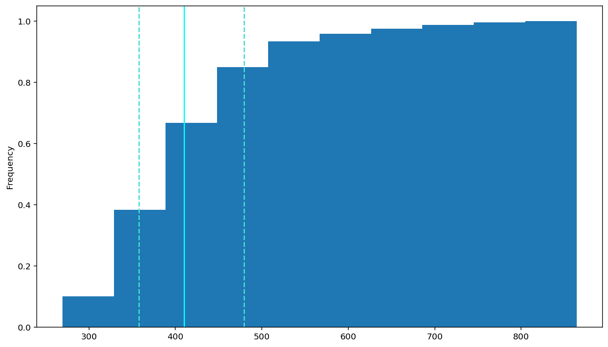
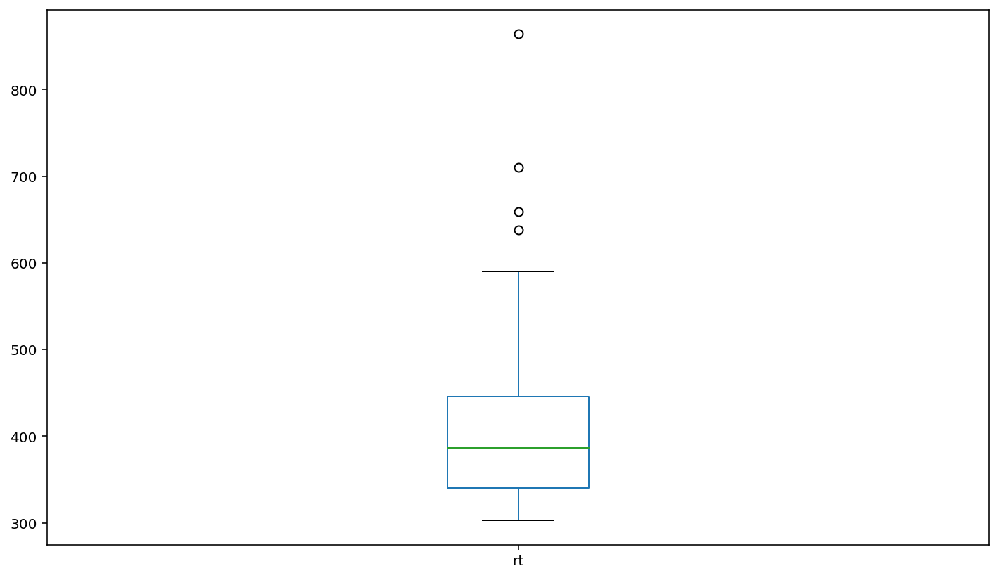
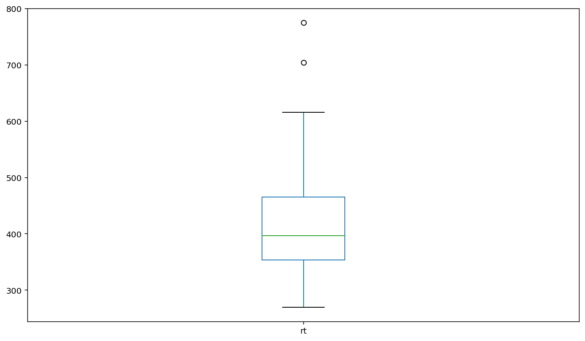
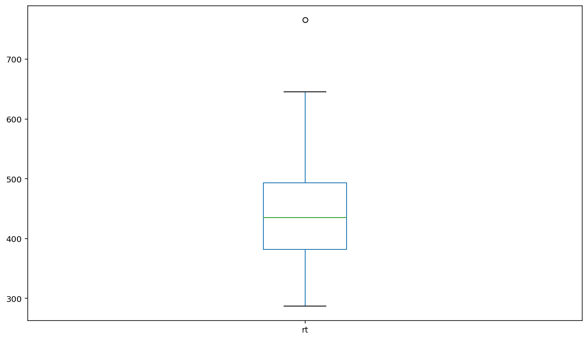
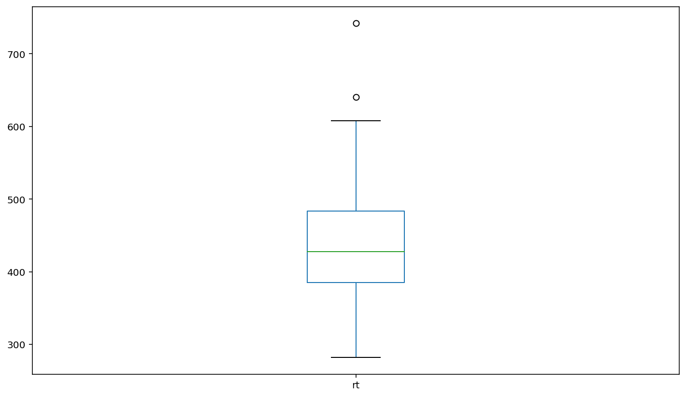

```python
# Plot histogram
df.rt.plot(kind = 'hist')

# Add a solid line at the median and dashed lines at the 25th and 75th 
# percentiles (done for you)
plt.axvline(df['rt'].describe()['25%'], 0, 1, color='turquoise', linestyle='--')
plt.axvline(df['rt'].median(), 0, 1, color='cyan', linestyle='-')
plt.axvline(df['rt'].describe()['75%'], 0, 1, color='turquoise', linestyle='--')

# Display plot
plt.show()
```




```python
# Plot the CDF
df.rt.plot(kind='hist', cumulative=True, density=True)

# Add a solid line at the median and dashed lines at the 25th and 75th 
# percentiles (done for you)
plt.axvline(df['rt'].describe()['25%'], 0, 1, color='turquoise', linestyle='--')
plt.axvline(df['rt'].median(), 0, 1, color='cyan', linestyle='-')
plt.axvline(df['rt'].describe()['75%'], 0, 1, color='turquoise', linestyle='--')

# Display plot
plt.show()
```





```python
# Display boxplot of RTs by flanker and simon conditions
df.groupby(['flankers', 'simon']).plot(y='rt', kind='box')
```


    flankers     simon      
    congruent    congruent      AxesSubplot(0.125,0.125;0.775x0.755)
                 incongruent    AxesSubplot(0.125,0.125;0.775x0.755)
    incongruent  congruent      AxesSubplot(0.125,0.125;0.775x0.755)
                 incongruent    AxesSubplot(0.125,0.125;0.775x0.755)
    dtype: object













[⟵ Back](https://arlenejiang.github.io/arlenejiang/)
