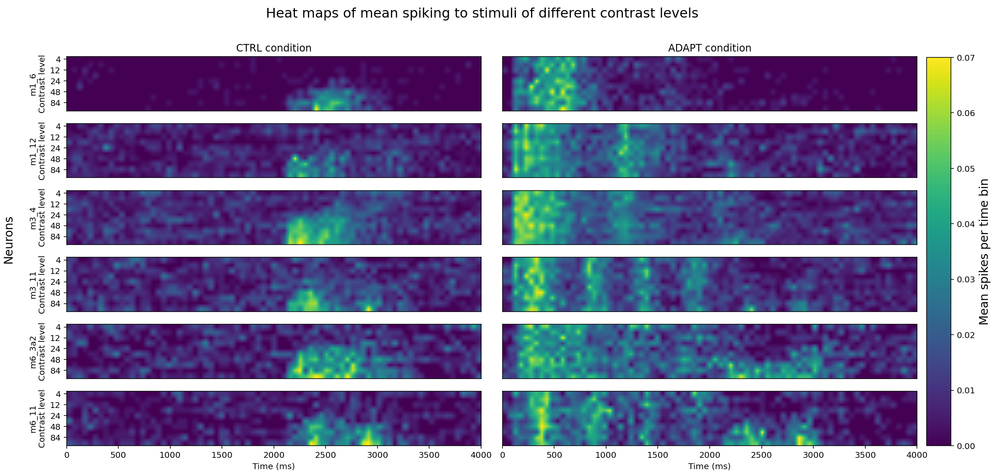

Import statements: 
```python
import pandas as pd
import numpy as np
from matplotlib import pyplot as plt
```


```python
cond_labels = ['CTRL', 'ADAPT'] 
contr_labels = [4, 8, 12, 16, 24, 32, 48, 64, 84, 100]
rep_labels = list(np.arange(1, 8))
num_reps = len(rep_labels)

time_labels = list(np.arange(4000))

stim_on_time = 2000
stim_off_time = stim_on_time + 1000

adapt_on_time = 0
adapt_off_time = adapt_on_time + 2000
```


```python
# Compute the total number of data points per neuron; we need to know how
#   many rows our DataFrame needs to have.
len_data = [(x * y * z) for x, y, z in [dat['SaveForAaron_May11_2020'][0][0][1].shape]][0]

# Set up vectors to label the columns in the pandas DataFrame
num_tp = dat['SaveForAaron_May11_2020'][0,0][1].shape[0]
time_labels = list(np.arange(num_tp))
times = time_labels * (len_data//len(time_labels))

num_condcontr = dat['SaveForAaron_May11_2020'][0,0][1].shape[2]
num_cond = len(cond_labels)
num_contr = len(contr_labels)

num_reps = dat['SaveForAaron_May11_2020'][0,0][1].shape[1]
rep_labels = list(np.arange(1, num_reps+1))
reps = np.tile(np.repeat(rep_labels, num_tp), num_cond * num_contr)

# Since condition and contrast are actually separate variables, we'll
#  break them out here.
contrs = np.tile(np.repeat(contr_labels, num_tp * num_reps), num_cond)
conditions = np.repeat(cond_labels, num_tp * num_reps * num_contr)

neuron_labels = ['m1_6', 'm1_12', 'm3_4', 'm3_11', 'm6_3a2', 'm6_11']
num_neurons = len(neuron_labels)
```

```python
# Define peri-stimulus time histogram bins 
hist_bin_width = 50 
time_bins = np.arange(0, max(time_labels), hist_bin_width)

# Intialize figure
fig = plt.figure(figsize=[10, 14])

# Name figure
plt.suptitle('Heat maps of mean spiking to stimuli of different contrast levels', fontsize=16)

# Initialize subplot counter and max spikes for color bar
subplot_counter = 1
max_spikes = 0

# Loop through neurons 
for neuron in neuron_labels:
    # Slice relevant section of DataFrame
    neu_dat = df[(df['neuron'] == neuron)]

    # Loop through conditions
    for cond in cond_labels:
        # Slice relevant section of DataFrame
        tmp_dat = neu_dat[(neu_dat['condition'] == cond)]
    
        # Initialize dictionary for PSTHs in the condition
        psth_temp = {}
        
        # Add subplot for each condition
        ax = fig.add_subplot(6, 2, subplot_counter)

        # Loop through contrasts
        for contr in contr_labels:
            # Slice relevant section of DataFrame
            spikeTimes = tmp_dat[(tmp_dat['contrast'] == contr) & (tmp_dat['spike'] == 1)]['time']
            
            # Calculate PSTHs
            nOut, bins = np.histogram(spikeTimes, bins=time_bins)
            psth_temp[contr] = nOut/(num_reps*hist_bin_width)

        # Plot heat map for one neuron's condition
        hmap = ax.imshow([psth_temp[i] for i in sorted(psth_temp.keys(), reverse=True)], extent = [min(time_labels), max(time_labels)+1, 10, 0], 
                         cmap='viridis', interpolation='bilinear', aspect='auto')

        # Find heat map with maximum spikes for color bar
        temp_max_spikes = max([max(p) for p in [psth_temp[i] for i in sorted(psth_temp.keys())]])
        if temp_max_spikes > max_spikes:
            max_map = hmap
            max_spikes = temp_max_spikes

        # Format plot

        # Title
        if subplot_counter == 1:
            plt.title('CTRL condition')
        if subplot_counter == 2:
            plt.title('ADAPT condition')

        # X-Axis
        if subplot_counter > 10:
            plt.xlabel('Time (ms)')
        else:
            plt.xticks([])
        
        #y-axis
        if subplot_counter % 2 == 1:
            plt.yticks([0.5, 2.5, 4.5, 6.5, 8.5], contr_labels[::2])
            plt.ylabel(neuron + '\nContrast level', )
        else:
            plt.yticks([])

        plt.tight_layout(rect=[0, 0, 1, 0.97])
        
        # Increase subplot counter
        subplot_counter += 1

# Set y-axis label
fig.subplots_adjust(left = 0.05)
fig.text(0.02, 0.5, 'Neurons', fontsize=14, ha='center', va='center', rotation='vertical')

# Plot colour bar from heat map with maximum mean spiking per bin
cb = fig.colorbar(max_map, cax=fig.add_axes([0.95, 0.036, 0.04, 0.9]))
cb.ax.set_ylabel('Mean spikes per time bin', fontsize=14)

# Display plot
plt.show()
```



[⟵ Back](https://arlenejiang.github.io/arlenejiang/)
